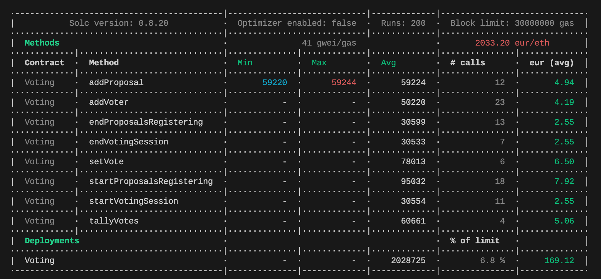

# ⚡️ alyra-project2 - Système de vote 2

## :point_right: Enoncé

Oui oui, nous allons repartir du défi “Système de vote” !

Vous repartirez du smart contract proposé en correction

Depuis la dernière version, vous avez vu la partie CI/CD avec les tests et le déploiement.

Vous devez alors fournir les tests unitaires de votre smart contract Nous n’attendons pas une couverture à 100% du smart contract mais veillez à bien tester les différentes possibilités de retours (event, revert).

## :point_right: Complément d'information

## :point_right: Stratégie de test

Le plan de test est simple: passer en revue l'ensemble des méthodes du contract _Voting.sol_. Pour cela j'ai effectué les tâches suivantes avec pour objectif d'atteindre 100% de coverage:

-   Défini un objet _WorkflowStatus_ pour répliquer l'enum des différents états du workflow qui se trouve dans le contrat _Voting.sol_.
-   Défini mes fixtures pour préparer notre environnement pour nos tests. J'ai pris l'initiative de n'utiliser que des fixtures et aucun appel aux fonctions natives de mocha: _before_ et _beforeEach_.
-   Défini mes tests unitaires en passant sur chaque méthode. Chaque méthode correspond à un _describe_ qui contient plusieurs tests propre à cette dernière. Chaque groupe de méthodes est lui-même placé dans un describe de contexte. Pour chaque méthode et afin de déterminer les tests à réaliser nous avons suivi les étapes suivantes:
    -   Tester le/les modifiers
    -   Tester les différents require
    -   Tester les événements émis
    -   Tester un cas de succès
    -   Eventuels autres tests
-   Défini mes tests End to End qui couvrent des aspects fonctionnels non abordés dans les autres tests.

J'ai implémenté **50 tests unitaires et e2e qui couvrent 100% du code de notre contrat Solidity** comme nous allons le voir dans les prochaines sections.

## :point_right: Coverage

### Hardhat tests run

### Hardhat tests gas report (in €)

**Attention:** aucune optimisation de gas n'a été faite sur ce projet notamment pour ne pas modifier le contrat d'origine. L'_optimizer_ n'a pas non plus été activé (et est donc par défaut à 200).

### Codecov Badge and heating maps

J'ai développé une action Github pour uploader tous les fichiers de coverage resultant des tests hardhats sur Codecov afin de tracker la progression du coverage: [codecov.yml](./.github/workflows/codecov.yml). Cette action m'a également permis d'ajouter des informations de coverage sur ce README.

Voici le badge Codecov qui indique le pourcentage de coverage du projet:

Voici ci-dessous les graphiques générés par Codecov illustrant le coverage du projet:

#### 1. Sunburst

#### 2. Grid

#### 3. Icicle

